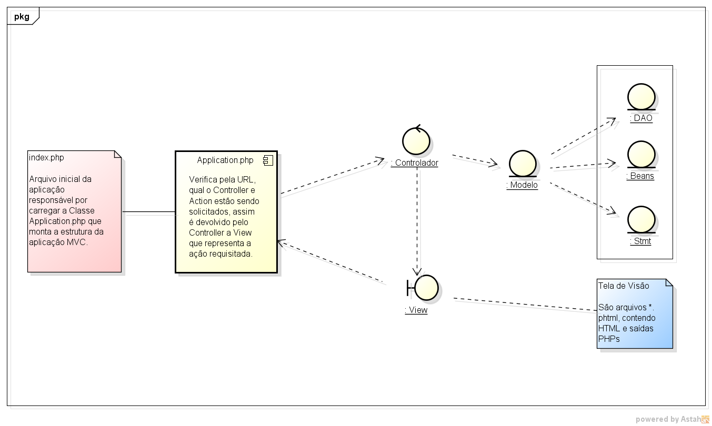

# appInicialZF
Repositório inicial de uma aplicação padrão MVC com a Biblioteca do Zend Framework 1

Sobre o autor deste documento
-----------------------------
Me chamo Carlos Anders, sou um desenvolvedor web, especializado em [php][PHP], [jQuery][jquery], [jQuery EasyUI][easyui] etc.
 
Site: [AndersHost][anders] 

[PHP]: http://www.php.net
[anders]: http://www.andershost.com.br
[xampp]: https://www.apachefriends.org/pt_br/index.html
[jquery]: http://jquery.com
[easyui]: http://www.jeasyui.com

Estrutura da Aplicação appInicialZF
--------------------------------------
A figura abaixo, ilustra o fluxo interno da aplicação MVC.

Requisitos de funcionamento:

* Servidor HTTP apache; 
* PHP 5.2 ou superior; 
*	Módulo rewrite ativo; 
*	Extensão PDO do PHP ativo; 
*	Opcional: acrescentar no php.ini a linha: include_path = ".;C:/xampp/apps/ZendFramework-1.12.3/library".

A estrutura do projeto organizada em hierarquia de pastas para o correto funcionamento do sistema.

Diretórios RAIZ do projeto. 
<pre>
<strong>appInicialZF/</strong>
	application/		- Core da aplicação, nela que adiciona os arquivos PHP.
		app/		- Faz com que o MVC aconteça.
		beans/		- Estrutura para serem colocados os beans desenvolvidos.
		configs/	- Arq. de inicialização da aplicação e mapeamentos de diretórios.
		controllers/	- Arq. que conterão os controllers da aplicação.
		dao/		- Arq. que conterão os DAO da aplicação.
		helpers/	- Dir. contendo arquivos que auxiliaram a aplicação.
		models/		- Dir. contendo os Statement que se comunicarão com os DAOs.
		views/		- Dir. contendo as views pertecendo aos métodos dos controllers.
		database/	- Dir. para exemplo contendo um arquivo sqllite.
	library/			- Dir. para serem adicionadas as bibliotecas de terceiros.
		ZendLibrary_1.12.3/	- A Biblioteca do ZF1 é necessário para que a aplicação funcione.
		PHPThumb_3.0/   - Biblioteca opcional.
	logs/		       - Dir. contendo os logs de erros da aplicação.
		public_html/	  - Dir. público da aplicação.
			common/	  - Dir. contendo arquivos de css, js, ícones e library de terceiros.
			css/	  - Dir. com os CSS da aplicação.
			ícones/	  - Dir. com os ícones para serem usados na aplicação.
			imagens/  - Dir. com imagens usadas na aplicação.
			images/	  - Idem do item acima.
			js/	  - Dir. contendo seus “Java scripts” personalizados para aplicação.
			library/  - Dir. contendo as bibliotecas de terceiros para serem usadas.
		excel/		  - Dir. opcional.
</pre>

Para instalar a aplicação no localhost pelo xampp acesse a URL [xampp].
 
Após instalar no xampp tem que certificar que o módulo LoadModule rewrite_module modules/mod_rewrite.so, está com habilitado no arquivo httpd.conf do apache, com isso, o projeto fica habilitado para funcionar com reescrita de url, aumentando a segurança da aplicação.
 
Para disponibilizar a Biblioteca do ZF em todas as suas aplicações e não somente nesta, adicione a linha opcional dos requisitos do funcionamento do sistema no PHP.INI.

		include_path = ".;C:/wamp/apps/ZendFramework-1.12.3/library".

Adicione o projeto em um host virtual, inserindo as seguintes linhas no arquivo http-vhost.conf, que se encontra no diretório “conf/extra/http-vhosts.conf”.
		
		NameVirtualHost appInicialZF.dev:81

		<VirtualHost skeletonInicial.dev:81>
			DocumentRoot "C:/projetos/htdocs/appInicialZF/public_html"		
			ServerName appInicialZF.dev
			SetEnv APPLICTAION_ENV "development"
			SetEnv PROJECT_ROOT "C:/projetos/htdocs/appInicialZF"
			<Directory C:/projetos/htdocs/appInicialZF/public_html>
				DirectoryIndex index.php
				AllowOverride all
				Require all granted
				Order allow,deny
				Allow from all
			</Directory>
		</VirtualHost>

Após as linhas adicionadas alterar o arquivo “hosts”, que se encontra no diretório: 

    c:/windows/System32/drivers/etc/hosts , 
    #e adicionar a seguinte linha:
    127.0.0.1 appInicialZF.dev
    
Reiniciar o apache e testar na url o projeto.
 
Arquivo de configuração da aplicação – application.ini, contém as informações estáticas do projeto e acesso a base de dados.
 
Formas de acesso ao projeto pela URL:
 
[http://appInicialZF.dev:81/index.php?pg=main/inicio](http://appInicialZF.dev:81/main/inicio) – sem escrita de url
 
[http://appInicialZF.dev:81/main/inicio](http://appInicialZF.dev:81/main/inicio) – com escrita de url

